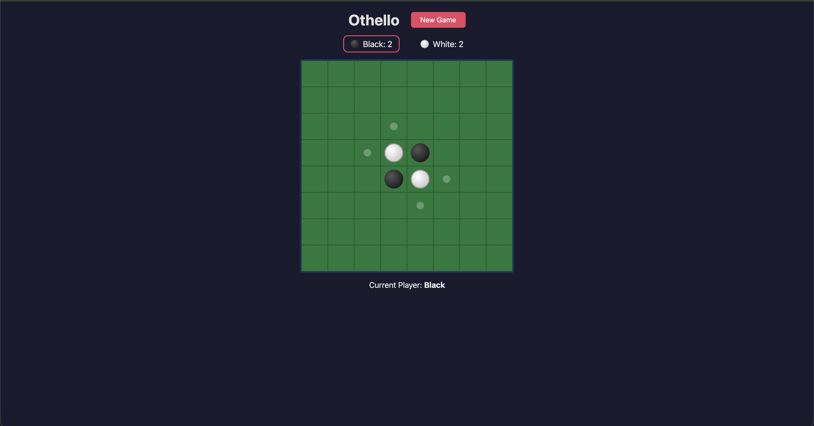

# Othello

A classic two-player strategy board game where you outmaneuver your opponent by flipping their discs to your color. Simple to learn, hard to master.



---

## Quick Start

Clone the repo and run one command:

```sh
git clone <repo-url>
cd Othello
./start.sh
```

The script will install all dependencies, start both servers, and open the game in your terminal. Once you see the "Game is ready!" message, open **http://localhost:5173** in your browser.

Press `Ctrl+C` to stop the game.

---

## Prerequisites

You need these installed on your machine before running the game:

| Tool | Version | Download |
|------|---------|----------|
| **.NET SDK** | 10.0 or later | [dotnet.microsoft.com/download](https://dotnet.microsoft.com/download) |
| **Node.js** | 18.0 or later | [nodejs.org](https://nodejs.org/) |

Node.js also installs **npm**, which is needed for the frontend.

---

## Manual Setup

If you prefer to run the servers yourself instead of using `start.sh`:

**Terminal 1 — Start the backend:**

```sh
cd OthelloAPI
dotnet restore
dotnet run
```

**Terminal 2 — Start the frontend:**

```sh
cd Frontend
npm install
npm run dev
```

Open **http://localhost:5173** in your browser. Both servers must be running at the same time.

---

## How to Play

### The Board

Othello is played on an **8x8 grid**. The game starts with four discs placed in the center:

```
. . . . . . . .
. . . . . . . .
. . . . . . . .
. . . W B . . .
. . . B W . . .
. . . . . . . .
. . . . . . . .
. . . . . . . .
```

**Black** always moves first.

### Goal

Win the game by having **more discs of your color** on the board when the game ends.

### Valid Moves

You can only place a disc on a cell where it will **capture** at least one of your opponent's discs. A capture happens when your disc "sandwiches" one or more opponent discs between the one you just placed and another disc you already own, in a straight line (horizontal, vertical, or diagonal).

**Example:** If Black places a disc to the left of a White disc, and there is already a Black disc on the other side, the White disc in between flips to Black.

### Flipping Discs

When you make a valid move, **all** opponent discs that are sandwiched between your new disc and any of your existing discs — in any direction — flip to your color. A single move can flip discs in multiple directions at once.

### Turn Skipping

If a player has **no valid moves** available, their turn is skipped and the other player goes again. This can happen multiple times in a row.

### Winning

The game ends when:
- **Neither player** has any valid moves, or
- **The board is full**

The player with the **most discs** wins. If both players have the same number of discs, the game is a **draw**.

---

## Game Features

| Feature | Description |
|---------|-------------|
| **Valid Move Hints** | Small dots appear on cells where you can legally place your disc |
| **Live Scoreboard** | Your current disc count is always visible at the top |
| **Turn Indicator** | The active player's score glows to show whose turn it is |
| **Turn Skip Alert** | A message appears if your turn gets skipped due to no valid moves |
| **Game Over Announcement** | The winner (or draw) is announced clearly at the end |
| **New Game** | Click "New Game" at any time to restart |

---

## Controls

- **Click a cell** to place your disc (only valid moves are accepted)
- **Click "New Game"** in the top-right corner to restart

---

## Tips

- **Corners are king.** Once you occupy a corner, it can never be flipped. Prioritize securing corners.
- **Avoid the diagonals next to corners.** Placing a disc diagonally adjacent to a corner can give your opponent access to it.
- **Edges are stable.** Edge discs are harder to flip because they have fewer directions to be attacked from.
- **Think ahead.** Every move flips discs — consider what new moves you're giving your opponent.
- **Control the center early.** The center discs give you the most flexibility in the opening.
- **Count moves, not discs.** Having fewer discs early can be an advantage if it means your opponent runs out of moves first.